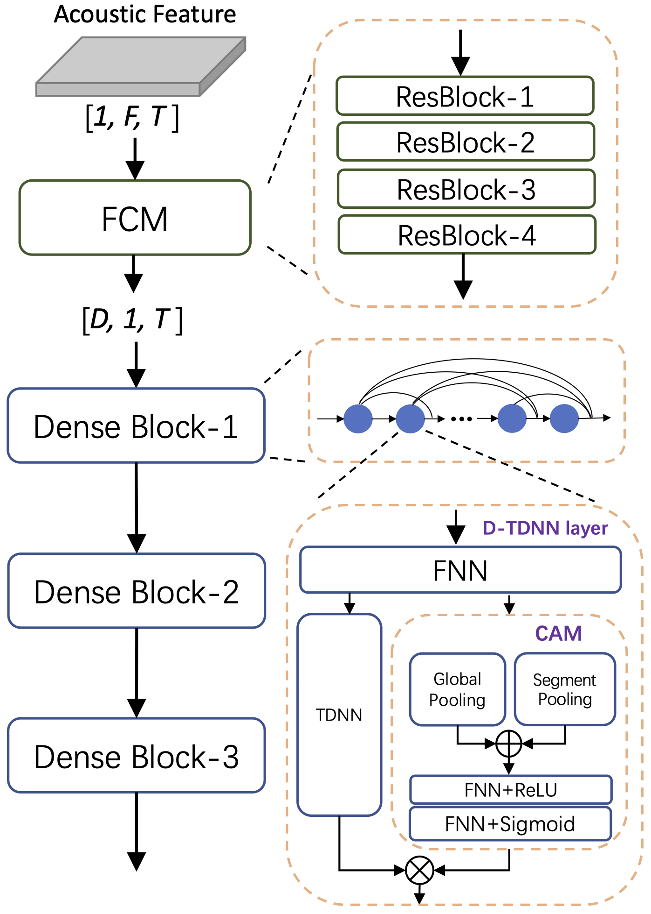

---
tasks:
- speaker-verification
model_type:
- CAM++
domain:
- audio
frameworks:
- pytorch
backbone:
- CAM++
license: Apache License 2.0
language:
- cn
tags:
- speaker verification
- CAM++
- 3DSpeaker
widgets:
  - task: speaker-verification
    model_revision: v1.0.0
    inputs:
      - type: audio
        name: input
        title: 音频
    extendsParameters:
      thr: 0.39
    examples:
      - name: 1
        title: 示例1
        inputs:
          - name: enroll
            data: git://examples/speaker1_a_cn_16k.wav
          - name: input
            data: git://examples/speaker1_b_cn_16k.wav
      - name: 2
        title: 示例2
        inputs:
          - name: enroll
            data: git://examples/speaker1_a_cn_16k.wav
          - name: input
            data: git://examples/speaker2_a_cn_16k.wav
    inferencespec:
      cpu: 8 #CPU数量
      memory: 1024
---

# CAM++说话人识别模型
CAM++模型是基于密集连接时延神经网络的说话人识别模型。相比于一些主流的说话人识别模型，比如ResNet34和ECAPA-TDNN，CAM++具有更准确的说话人识别性能和更快的推理速度。该模型可以用于说话人确认、说话人日志、语音合成、说话人风格转化等多项任务。
## 模型简述
CAM++兼顾识别性能和推理效率，在公开的中文数据集CN-Celeb和英文数据集VoxCeleb上，相比主流的说话人识别模型ResNet34和ECAPA-TDNN，获得了更高的准确率，同时具有更快的推理速度。其模型结构如下图所示，整个模型包含两部分，残差卷积网络作为前端，时延神经网络结构作为主干。前端模块是2维卷积结构，用于提取更加局部和精细的时频特征。主干模块采用密集型连接，复用层级特征，提高计算效率。同时每一层中嵌入了一个轻量级的上下文相关的掩蔽(Context-aware Mask)模块，该模块通过多粒度的pooling操作提取不同尺度的上下文信息，生成的mask可以去除掉特征中的无关噪声，并保留关键的说话人信息。

<div align=center>

</div>

更详细的信息见
- 论文：[CAM++: A Fast and Efficient Network for Speaker Verification Using Context-Aware Masking](https://arxiv.org/abs/2303.00332)
- github项目地址：[3D-Speaker](https://github.com/alibaba-damo-academy/3D-Speaker)

## 训练数据
本模型使用公开的中文说话人数据集3DSpeaker进行训练，包含约1w个说话人。
## 模型效果评估
在3DSpeaker的3个测试集的EER评测结果对比：
| Model | Params | Cross-Device | Cross-Distance | Cross-Dialect |
|:-----:|:------:| :------:|:------:|:------:|
| ECAPA-TDNN | 20.8M | 8.87% | 12.26% | 14.53% |
| CAM++ Base | 7.2M | 7.75% | 11.29% | 13.44% |


# 如何快速体验模型效果
## 在Notebook中体验
对于有开发需求的使用者，特别推荐您使用Notebook进行离线处理。先登录ModelScope账号，点击模型页面右上角的“在Notebook中打开”按钮出现对话框，首次使用会提示您关联阿里云账号，按提示操作即可。关联账号后可进入选择启动实例界面，选择计算资源，建立实例，待实例创建完成后进入开发环境，输入api调用实例。
``` python
from modelscope.pipelines import pipeline
sv_pipeline = pipeline(
    task='speaker-verification',
    model='damo/speech_campplus_sv_zh-cn_3dspeaker_16k'
)
speaker1_a_wav = 'https://modelscope.cn/api/v1/models/damo/speech_campplus_sv_zh-cn_3dspeaker_16k/repo?Revision=master&FilePath=examples/speaker1_a_cn_16k.wav'
speaker1_b_wav = 'https://modelscope.cn/api/v1/models/damo/speech_campplus_sv_zh-cn_3dspeaker_16k/repo?Revision=master&FilePath=examples/speaker1_b_cn_16k.wav'
speaker2_a_wav = 'https://modelscope.cn/api/v1/models/damo/speech_campplus_sv_zh-cn_3dspeaker_16k/repo?Revision=master&FilePath=examples/speaker2_a_cn_16k.wav'
# 相同说话人语音
result = sv_pipeline([speaker1_a_wav, speaker1_b_wav])
print(result)
# 不同说话人语音
result = sv_pipeline([speaker1_a_wav, speaker2_a_wav])
print(result)
# 可以自定义得分阈值来进行识别
result = sv_pipeline([speaker1_a_wav, speaker2_a_wav], thr=0.6)
print(result)
```
## 训练和测试自己的CAM++模型
本项目已在[3D-Speaker](https://github.com/alibaba-damo-academy/3D-Speaker)开源了训练、测试和推理代码，使用者可按下面方式下载安装使用：
``` sh
git clone https://github.com/alibaba-damo-academy/3D-Speaker.git && cd 3D-Speaker
conda create -n 3D-Speaker python=3.8
conda activate 3D-Speaker
pip install -r requirements.txt
```

运行CAM++在VoxCeleb集上的训练样例
``` sh
cd egs/voxceleb/sv-cam++
# 需要在run.sh中提前配置训练使用的GPU信息，默认是4卡
bash run.sh
```

# 相关论文以及引用信息
如果你觉得这个该模型有所帮助，请引用下面的相关的论文
```BibTeX
@article{cam++,
  title={CAM++: A Fast and Efficient Network for Speaker Verification Using Context-Aware Masking},
  author={Hui Wang and Siqi Zheng and Yafeng Chen and Luyao Cheng and Qian Chen},
  journal={arXiv preprint arXiv:2303.00332},
}
```
